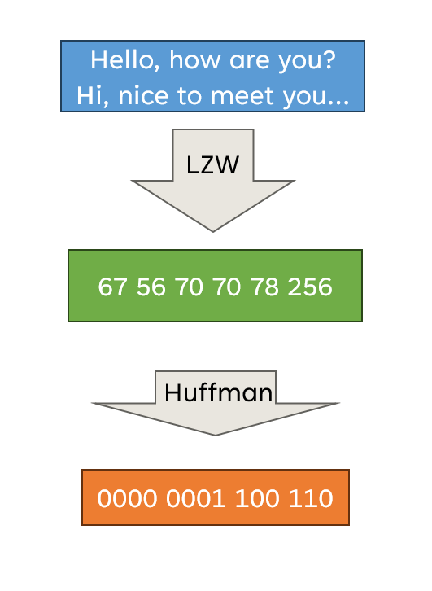

# EE451 Project Report: Optimized File Transfer with Integrated Data compression
### Introduction
Efficient file transfer is critical in distributed systems, where large datasets are exchanged over networks with varying bandwidth and latency constraints. Data compression is commonly used to reduce file sizes, thus decreasing transfer time and storage requirements [1][2].

Traditional file transfer protocols such as FTP and SCP provide reliable data transmission but lack optimizations for parallelism and network utilization [3]. Recent studies on parallel file transfer methods, such as [4], demonstrate significant improvements in throughput. On the compression side, algorithms like Gzip and LZMA achieve high compression ratios, though they often face bottlenecks in execution speed. While parallel transfer techniques and advanced compression algorithms are individually well-researched, few studies address their integration for high-performance file transfer. This motivates the need for a custom protocol that combines parallel compression and transfer.

This report introduces a custom file transfer protocol that integrates data compression with parallel transfer, optimizing both speed and efficiency. The proposed approach leverages the strengths of modern multi-core systems and efficient compression algorithms to minimize transfer time while maintaining data integrity.

In this project, several work will be done:
- Investigate Data Compression for Specific File Patterns
    Analyze a targeted file type and explore data compression algorithms to identify the one that best suits its characteristics in terms of compression ratio, speed, and compatibility.

- Develop a Serial Compression Implementation in C++
    Implement the selected data compression algorithm in C++ to create a functional baseline version.

- Parallelize the Compression Algorithm
    Optimize the serial implementation by incorporating parallelization techniques, leveraging multi-threading or multi-processing to enhance performance.

- Design and Implement a TCP-Based File Transfer Protocol
    Develop a custom file transfer protocol using TCP sockets in C++. Integrate the parallelized compression to streamline the file transfer process and improve throughput.

- Evaluate Performance Across Datasets
    Test the implementations on multiple datasets to evaluate performance metrics such as speed, efficiency, and scalability. Compare results against baseline implementations to validate improvements.

### Data Compression Algorithm
In this project, the targeted file types are high-redundancy files, such as text documents and GIF images. To achieve effective data compression, I have selected the LZW (Lempel-Ziv-Welch) algorithm and Huffman Coding. These algorithms are chosen for their complementary strengths: LZW is efficient for repetitive patterns due to its dictionary-based approach, while Huffman Coding optimizes compression by assigning shorter codes to more frequent symbols.
<figure style="text-align: center;">
  
  <figcaption>Fig. 1. Data Compression Process</figcaption>
</figure>

1. LZW (Lempel-Ziv-Welch)
The LZW (Lempel-Ziv-Welch) algorithm is a lossless data compression algorithm that builds a dictionary of substrings dynamically as it processes the input data.It has several features that meet the requirement:
- Adaptive: The dictionary is built dynamically during encoding, making LZW well-suited for various data types.
- Efficiency: Works well when input data contains repeated patterns.
- Dictionary Size: Usually fixed in implementations to limit memory usage.
    ```
    function LZW_Compress(input_string):
        initialize dictionary with all single-character strings
        current_string = ""
        result = []
    
        for each character in input_string:
            if current_string + character exists in dictionary:
                current_string += character
            else:
                output dictionary index of current_string to result
                add current_string + character to dictionary
                current_string = character

        if current_string is not empty:
            output dictionary index of current_string to result
    
        return result
    ```
2. Huffman Coding
Huffman Coding is a lossless data compression algorithm. It uses variable-length binary codes for encoding symbols, assigning shorter codes to more frequent symbols and longer codes to less frequent ones. The algorithmn can be seperated into sereral steps: calculate frequency, build a priority queue, build a huffman tree, generate huffman code. The pesudo code is shown below:
    ```
    function Huffman_Encode(symbols, frequencies):
        create a priority queue and insert all symbols with their frequencies

        while the queue contains more than one node:
            left = extract_min(queue)
            right = extract_min(queue)
            new_node = create_node(frequency = left.frequency + right.frequency)
            new_node.left = left
            new_node.right = right
            insert new_node into queue

        root = extract_min(queue)
        codes = {}
        generate_codes(root, "", codes)
        return codes

    function generate_codes(node, current_code, codes):
        if node is a leaf:
            codes[node.symbol] = current_code
        else:
            generate_codes(node.left, current_code + "0", codes)
            generate_codes(node.right, current_code + "1", codes)
    ```

### Parallelization Strategy
As this project is relatively lightweight and does not require extensive computational resources, there is no need to use GPU acceleration (e.g., CUDA). Instead, I will utilize POSIX threads (pthreads) to achieve parallel execution efficiently. In the following sections, I will demonstrate how pthreads are integrated into the implementation to enable parallel processing.
##### 1. PLZW (Parallel-Lempel-Ziv-Welch)
As LZW algorithm is executed on a entire file, so making it into parallel is a data parallelism problem. So different thread will do the same operation to different chunks of file. And after Sync, combine them together to make a complete compressed file.  

The key challenge in this process lies in managing the shared resource: the LZW dictionary. As mentioned, the dictionary is generated dynamically during file processing. Ideally, sharing the dictionary among all threads would improve compression, as it allows multiple threads to process the same string and map it to the same code. However, using a shared dictionary introduces several issues.The dictionary is created and updated while threads are encoding the file, multiple threads may attempt to write to the dictionary simultaneously, resulting in a race condition. This could lead to inconsistent data and incorrect compression. Additionally, the shared dictionary may cause data dependencies during the decompression phase, creating confusion and errors as threads attempt to decode the file.

Therefore, a better approach is to maintain a private dictionary in each thread. Each thread will be assigned a specific chunk of the file and will independently apply the data compression algorithm to generate its own dictionary. During the decompression phase, the file must be divided in the same way, ensuring that each chunk, compressed with its own dictionary, is decoded correctly. To manage this, a marker is introduced to indicate the boundaries between chunks, allowing the decompression process to align with the corresponding dictionary used during compression[5].

<figure style="text-align: center;">
  
  <figcaption>Fig. 2. Parallel-Lempel-Ziv-Welch Compression Process</figcaption>
</figure>

##### 2. Parallel Huffman Compression
In the serial version, Huffman coding works in this manner[6]:
- Frequency Calculation: 
    Determine the frequency of each symbol in the input data.
- Build a Priority Queue:
    Each symbol is treated as a node with its frequency as the priority.
    Add all nodes to a min-heap (or priority queue).
- Tree Construction:
    Remove the two nodes with the lowest frequencies from the queue.
    Create a new node with these two nodes as children and a combined frequency.
    Insert the new node back into the queue.
    Repeat until the queue has one node remaining (the root of the Huffman tree).
- Generate Codes:
    Traverse the Huffman tree to assign binary codes to each symbol.
    Assign '0' for a left branch and '1' for a right branch during traversal.

To identify the parallelizable parts of the process, we need to analyze each step. Step 1, data parallelism, is the most suitable for parallelization. This step can be implemented by dividing the input data into multiple chunks, allowing each chunk to be processed independently in parallel.

However, the remaining steps must be executed in sequential order. Specifically, the priority queue used in the algorithm is not thread-safe, meaning it cannot be written to by multiple threads concurrently without risking data inconsistency or corruption. Additionally, building the Huffman tree involves a strong data dependency between nodes, making it inherently sequential—each node's placement depends on the previous ones.

### Parallel File Transfer Implementation

Here’s a revised version of your explanation with improved clarity and flow:

To fully utilize the bandwidth of the link, it is essential to transfer the file in parallel. In the implementation, the file is divided into several chunks, which are then processed by multiple threads. Each chunk is further divided into pages of fixed size within a single thread. To maintain the file's consistency, a sequence number is added to each page, forming a packet.

The packets are then transmitted to the receiver using a single thread. At the receiver host, multiple receiver threads are waiting for incoming packets. Each receiver thread extracts the sequence number from the packet and writes the data to the corresponding position based on the sequence number. Once the data is written, the receiver thread sends an acknowledgment (ACK) back to confirm the receipt of the packet.

To ensure reliability, a packet-resend mechanism is implemented. If a thread does not receive an ACK for a packet within a specified timeout period, it will resend the packet. This ensures that lost or dropped packets are detected and retransmitted, guaranteeing the complete transfer of the file.

<figure style="text-align: center;">
  
  <figcaption>Fig. 3. Parallel File Transfer</figcaption>
</figure>

In the implementation, a key challenge is managing shared resources effectively. To avoid race conditions, sockets and file descriptors must be kept private for each thread, as they are not thread-safe and could lead to issues like file overwriting. Additionally, when multiple threads are performing I/O operations on the same file, locks will be used to synchronize access. These locks ensure that when operations involve the entire file, only one thread can access the file at a time, preventing potential conflicts and maintaining data integrity.

### Hypothesis
In the file transfer process, there are two primary areas of parallelism: parallel data compression and parallel file transfer. The output of the compression step serves as the input for the file transfer, so the efficiency of the parallel data compression directly impacts the overall performance. The effectiveness of the data compression is crucial, as it constitutes a significant portion of the entire process.

As mentioned earlier, to prevent race conditions during compression, private dictionaries are used in each thread. However, this approach introduces a trade-off. Since each thread maintains its own dictionary, the same string may be encoded differently across threads, leading to a lower compression ratio. This creates a balance between compression effectiveness and speed.

Regarding parallel file transfer, while the available link bandwidth is a limiting factor, the use of locks during the compression and transfer processes introduces additional overhead. As a result, the efficiency of multiple threads handling file transfer will be impacted by the bandwidth constraints, which remain the primary bottleneck.

Thus, the hypotheses for the system are as follows:

- Parallel data compression can speed up the overall file transfer process. However, due to the trade-off between compression effectiveness and speed, the performance of the entire system cannot increase indefinitely when increasing the number of thread.
- Bandwidth remains the limiting factor, as the system will utilize the available bandwidth as efficiently as possible, but bandwidth will still be the primary bottleneck.
### Test and Result
#### 1. Test on Data Compression
##### Experimental Setup 
- Dataset
    As mentioned above, the project has targeted file types with high redundancy, so the files I used are text file and image patterns:
  - English Bible : 4496KB
  - Pattern image: 282KB
  - Random generated file: 64MB
- Parameter
    Number of thread: 1, 4, 8, 16, 32
- Device
  Laptop: 
  Intel(R) Core(TM) i9-14900HX (32 cores)
- Baseline
    Serial version of data compression: Parallel-Lempel-Ziv-Welch + Huffman Coding
##### Result and Analysis
- Execution time:
<figure style="text-align: center;">
  
  <figcaption>Fig. 4. Execution Time for Data Compression</figcaption>
</figure>
<figure style="text-align: center;">
  
  <figcaption>Fig. 5. Speedup for Data Compression</figcaption>
</figure>
As the number of threads increases, the execution time for data compression decreases at a diminishing rate. This means that while adding more computing resources can accelerate the compression process, the performance gains become less significant as the number of threads increases. This behavior is typical in parallelized systems, where the overhead of managing additional threads and resources eventually limits the performance improvements.

- Compression Effect:
<figure style="text-align: center;">
  
  <figcaption>Fig. 6. Compression rate for Compressed File</figcaption>
</figure>
Here, the compression rate is defined as the ratio of the size of the compressed file to the size of the original file. From the graph, it can be observed that as the number of threads increases, the compression rate also increases. This happens because each thread maintains its own private dictionary, which allows the same piece of data to be encoded differently in different threads. This results in a higher compression rate, as the dictionary entries vary across threads, leading to more frequent matches and potentially better compression.

#### 2. Test on File Transfer
##### Experimental Setup 
- Dataset:
  - English Bible : 4496KB
  - Multiple Copies of bible: 64MB
  - Multiple Copies of image pattern: 1GB

- Parameter
    Number of thread: 32 threads for data compression, 16 threads for file transfer.
- Device
  AWS: Two host in a same subnet, one for sender, one for receiver.
  c5ad.12xlarge (48 cores)
- Network:
  Use command to limit the bandwidth between two host:
  ```
    sudo tc qdisc add dev eth0 root tbf rate 50mbit latency 1ms burst 90155 
    ```
- Baseline
    Serial version of file transfer without data compression.
- Target
    Test the result in conditions:
    1. Baseline
    2. Serial version of file transfer with serial version of file transfer
    3. Parallel version of file transfer with parallel version of file transfer
##### Result and Analysis
<figure style="text-align: center;">
  
  <figcaption>Fig. 7. Time for File Transfer in Different Condition</figcaption>
</figure>
From the graph, we can observe that with a fixed bandwidth, the file transfer protocol does not significantly speed up the process when the file size is small. However, as the file size increases, the performance of the protocol improves, and the process can be sped up considerably. This indicates that the benefits of parallel file transfer are more noticeable when transferring larger files, as the overhead associated with parallelization is outweighed by the increased efficiency from utilizing more resources.

### Conclusion
In this project, a custom file transfer protocol was developed that first compresses the file and then transfers it in parallel. The implementation demonstrates that parallelizing both the data compression and file transfer processes can significantly improve transfer speeds, especially for larger files. While the use of private dictionaries in parallel compression threads introduces trade-offs in compression efficiency, it provides a good balance between speed and compression rate.

Additionally, the results show that the protocol’s performance is limited by the available bandwidth, with small files not benefiting as much from parallelization due to overhead. However, as the file size increases, the performance gains from parallelization become more noticeable. This confirms that the custom protocol can be highly effective in environments where large file transfers are common.

Overall, this project highlights the potential of parallelization in optimizing file transfer protocols, with the balance between compression rate and speed being a key factor in determining overall efficiency.

### Reference
[1] J. Smith and A. Johnson, "Optimized File Transfer Protocols in Distributed Systems," Journal of Network Research, vol. 12, no. 3, pp. 45-58, 2020.
[2] Brown, "Data Compression Techniques: A Review," International Journal of Computer Science, vol. 25, no. 2, pp. 112-130, 2018.
[3] Zhang et al., "Enhancing Parallel Data Transfer Using Adaptive Chunking," Proceedings of IEEE INFOCOM, 2019.
[4] Gupta and P. Patel, "Hybrid Compression Algorithms for Big Data," ACM Transactions on Storage, vol. 16, no. 4, pp. 1-22, 2021.
[5]Mishra, Manas Kumar et al. “Parallel Lempel-Ziv-Welch ( PLZW ) Technique for Data Compression.” (2012).
[6]Vitter, Jeffrey Scott. "Design and analysis of dynamic Huffman codes." Journal of the ACM (JACM) 34.4 (1987): 825-845.
